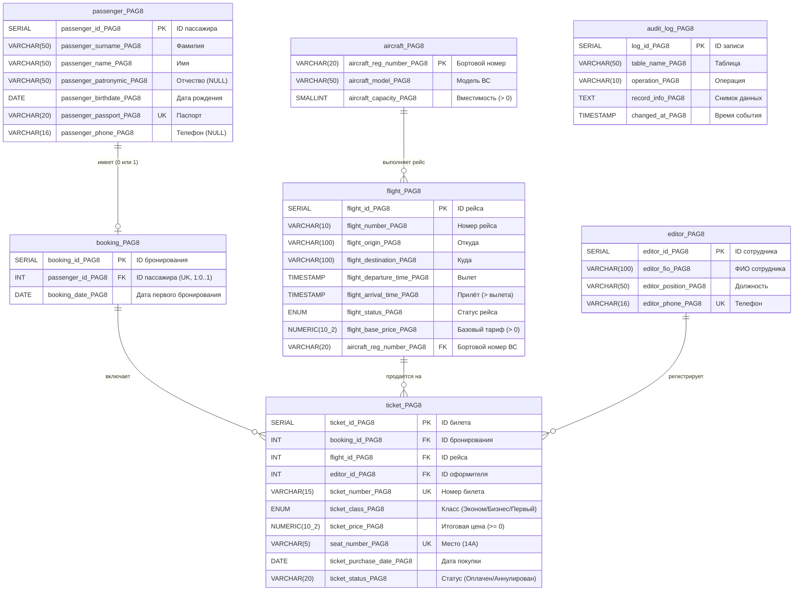

```mermaid
erDiagram
    aircraft_PAG8 ||--o{ flight_PAG8 : "выполняет рейс"
    passenger_PAG8 ||--o| booking_PAG8 : "имеет (0 или 1)"
    booking_PAG8 ||--o{ ticket_PAG8 : "включает"
    flight_PAG8 ||--o{ ticket_PAG8 : "продаётся на"
    editor_PAG8 ||--o{ ticket_PAG8 : "регистрирует"

    aircraft_PAG8 {
        VARCHAR(20) aircraft_reg_number_PAG8 PK "Бортовой номер"
        VARCHAR(50) aircraft_model_PAG8 "Модель ВС"
        SMALLINT aircraft_capacity_PAG8 "Вместимость (> 0)"
    }

    editor_PAG8 {
        SERIAL editor_id_PAG8 PK "ID сотрудника"
        VARCHAR(100) editor_fio_PAG8 "ФИО сотрудника"
        VARCHAR(50) editor_position_PAG8 "Должность"
        VARCHAR(16) editor_phone_PAG8 UK "Телефон"
    }

    passenger_PAG8 {
        SERIAL passenger_id_PAG8 PK "ID пассажира"
        VARCHAR(50) passenger_surname_PAG8 "Фамилия"
        VARCHAR(50) passenger_name_PAG8 "Имя"
        VARCHAR(50) passenger_patronymic_PAG8 "Отчество (NULL)"
        DATE passenger_birthdate_PAG8 "Дата рождения"
        VARCHAR(20) passenger_passport_PAG8 UK "Паспорт"
        VARCHAR(16) passenger_phone_PAG8 "Телефон (NULL)"
    }

    flight_PAG8 {
        SERIAL flight_id_PAG8 PK "ID рейса"
        VARCHAR(10) flight_number_PAG8 "Номер рейса"
        VARCHAR(100) flight_origin_PAG8 "Откуда"
        VARCHAR(100) flight_destination_PAG8 "Куда"
        TIMESTAMP flight_departure_time_PAG8 "Вылет"
        TIMESTAMP flight_arrival_time_PAG8 "Прилёт (> вылета)"
        ENUM flight_status_PAG8 "Статус рейса"
        NUMERIC(10_2) flight_base_price_PAG8 "Базовый тариф (> 0)"
        VARCHAR(20) aircraft_reg_number_PAG8 FK "Бортовой номер ВС"
    }

    booking_PAG8 {
        SERIAL booking_id_PAG8 PK "ID бронирования"
        INT passenger_id_PAG8 FK "ID пассажира (UK, 1:0..1)"
        DATE booking_date_PAG8 "Дата первого бронирования"
    }

    ticket_PAG8 {
        SERIAL ticket_id_PAG8 PK "ID билета"
        INT booking_id_PAG8 FK "ID бронирования"
        INT flight_id_PAG8 FK "ID рейса"
        INT editor_id_PAG8 FK "ID оформителя"
        VARCHAR(15) ticket_number_PAG8 UK "Номер билета"
        ENUM ticket_class_PAG8 "Класс (Эконом/Бизнес/Первый)"
        NUMERIC(10_2) ticket_price_PAG8 "Итоговая цена (>= 0)"
        VARCHAR(5) seat_number_PAG8 UK "Место (14A)"
        DATE ticket_purchase_date_PAG8 "Дата покупки"
        VARCHAR(20) ticket_status_PAG8 "Статус (Оплачен/Аннулирован)"
    }

    audit_log_PAG8 {
        SERIAL log_id_PAG8 PK "ID записи"
        VARCHAR(50) table_name_PAG8 "Таблица"
        VARCHAR(10) operation_PAG8 "Операция"
        TEXT record_info_PAG8 "Снимок данных"
        TIMESTAMP changed_at_PAG8 "Время события"
    }
```
